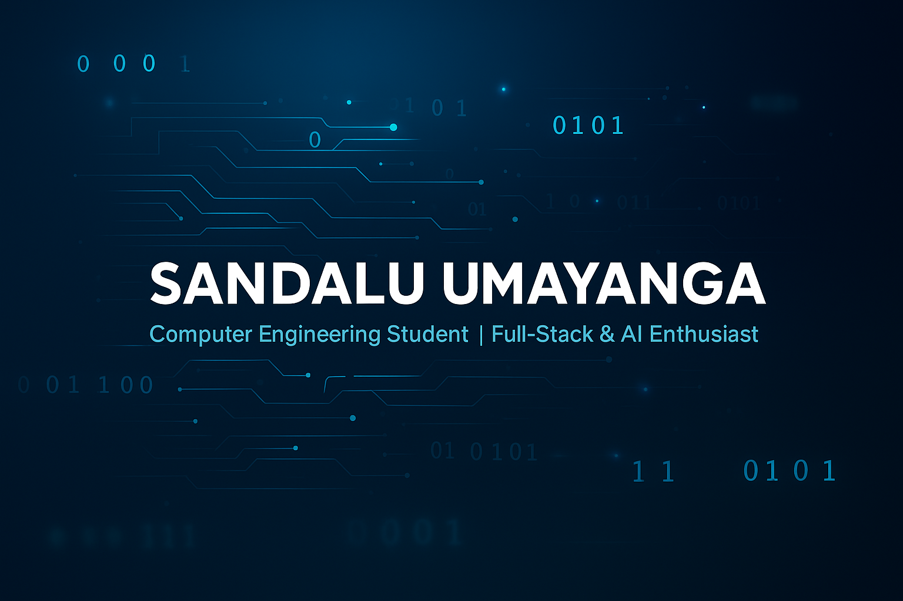

  

# Hi there, I'm Sandalu Umayanga 👋  

  
  
  

🎓 Final-Year Computer Engineering Student at the **University of Peradeniya, Sri Lanka**  
💻 Passionate about **Software Engineering, Machine Learning, and Full-Stack Development**  
🚀 Exploring the intersection of **AI, Embedded Systems, and Scalable Applications**  

---

## 🛠️ Tech Stack  

  
  
  
  
  
  
  
  
  
  
  
  
  
  
  

  

---

## 🌟 Featured Projects  

### 🚂 [RailLynk Frontend](https://github.com/sandalu-umayanga/3yp-railLynk-front)  
A **modern railway management system** frontend for Sri Lanka Railways.  
- Real-time **train tracking with interactive maps**  
- Multi-role authentication (Passenger, Station Master, Admin)  
- Smart card–based digital wallet & transaction system  
- Built with **React, Vite, Leaflet, Recharts**  

---

### 🎥 [YouTube Downloader](https://github.com/sandalu-umayanga/youtubedownloader)  
A cross-platform **JavaFX YouTube downloader** with MP3 extraction.  
- Multiple video/audio formats & quality options  
- Integrated **yt-dlp + FFmpeg**  
- Self-contained runtime via `jlink`  

---

### 🫀 [CathLab Management System](https://github.com/cepdnaclk/e20-co227-CathLab-Management-System)  
End-to-end solution for **digitalizing catheterization lab operations**.  
- **Backend**: Django REST + MySQL, JWT Authentication  
- **Frontend**: React + Vite + Chart.js  
- Features: Patient management, medical report generation, X-ray angiogram image processing  

---

### ✍️ [Handwritten Character Recognition](https://github.com/cepdnaclk/e20-co542-handwritten-character-recognition)  
Deep learning–based **handwritten character recognition** system.  
- CNN models in **PyTorch & TensorFlow**  
- 47-class SD19 dataset (digits + upper/lowercase letters)  
- Interactive GUI for real-time predictions  

---

## 📌 Other Notable Projects  

- 💕 [Romantic Calendar App](https://github.com/sandalu-umayanga/romantic_calendar) – Flask app that sends romantic holiday reminders via email  
- 🎬 [Movie Management System](https://github.com/sandalu-umayanga/Movie-Management-System) – Java project built with **TDD + JUnit**  
- 📚 [Learning Management System Frontend](https://github.com/sandalu-umayanga/new-lms-front) – React frontend for LMS  
- 📝 [Blog Platform](https://github.com/sandalu-umayanga/Blog-Platform) – Django-powered blogging system  
- 🌍 [Land Use Website](https://github.com/sandalu-umayanga/land-use) – GIS article site  

---

## 📊 GitHub Stats  

  

  

  

---

## 📈 Contribution Graph  

  

---

## 📌 Pinned Projects  

  
  

  
  

---

## 📫 Contact Me  

- 📧 Email: **e20284@eng.pdn.ac.lk**  
- 💼 LinkedIn: [linkedin.com/in/sandalu-umayanga](https://www.linkedin.com/in/sandalu-umayanga)  
- 🌐 Portfolio (coming soon...)  

---

## 💡 Personal Motto  

> *"Code with purpose, build with passion, and innovate for impact."*  

✨ Thanks for visiting my profile! Feel free to explore my repos and connect with me 🤝  
